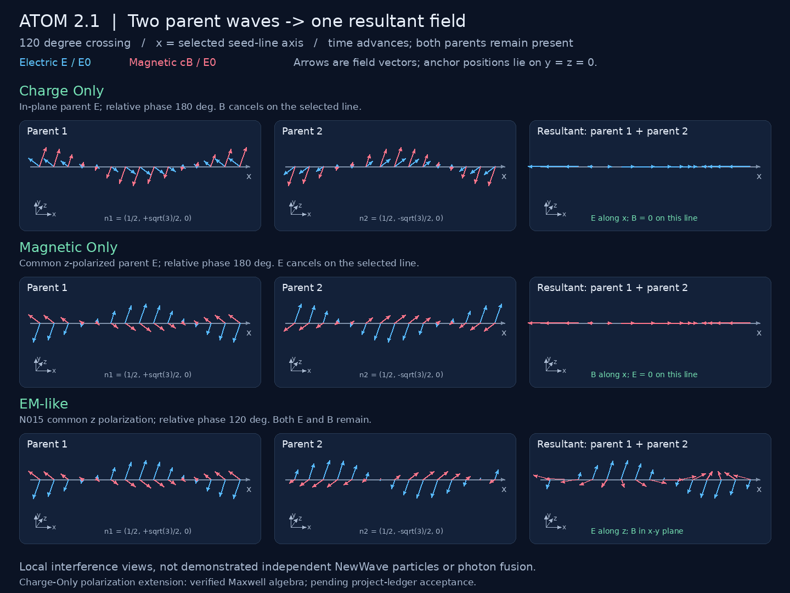

# Two waves into one resultant: NewWave field views

[Charge Only](figs/charge_only.gif) · [Magnetic Only](figs/magnetic_only.gif) · [EM-like](figs/em_like.gif)

## Provenance and scope

Requested by Craig Fink (WeBeGood), September 6, 2026. This corrects the prior conversation's failure to locate the actual GitHub ledger. The baseline is repository commit `d81b532103c53f1c5f5e70ccbdde1a6b77607836`, nodes N000, N011 and N015. N015 is an M3 tested baseline whose project status remains open. Its exclusions and project interpretation remain unchanged.

The animation evaluates two parent electromagnetic plane-wave fields and their exact vector sum at every displayed position and time. The three columns are the same spatial sample, not three successive stages of photon disappearance and creation. Infinite coherent waves overlap throughout this calculation. “One” means one resultant field E=E1+E2, B=B1+B2. Creation of an independent neutrino, localized seed or new photon is not established by this calculation.

The horizontal **x axis is the selected seed-line direction**, parallel to n1+n2. Field arrows represent signed vector components, not particle paths or mechanical displacement. Blue is E/E0; red is cB/E0. Projected z arrows slope up-right, y points up, and x points right. No knots, circulating field-line trajectories or reservoirs are drawn without a dynamical derivation.

## Progression from space, time and light

1. N000: position r=(x,y,z), time t, vacuum Maxwell fields, speed c.
2. N011: transverse parent polarizations and right-hand magnetic relation.
3. N015: n1=(1/2,sqrt(3)/2,0), n2=(1/2,-sqrt(3)/2,0), a 120-degree crossing with resultant direction +x.
4. Real parent fields: Ei=E0 ei cos(k ni dot r - omega t + delta_i), cBi=ni cross Ei, omega=ck.
5. Add the two fields at the same r,t. The selected line is y=z=0.

Geometric crossing angle and temporal phase offset are distinct. The 120-degree crossing is used for all views; cancellation views require relative phase 180 degrees on the selected line. The EM-like view uses phase 120 degrees. The animation does not substitute one of these angles for the other.

## Exact displayed expressions

Use E0=c=k=1 for rendering; omega=1. Let a=cos(x/2-t).

### Magnetic Only: existing N015 local cancellation

Set e1=e2=z-hat and delta2=pi. On y=z=0:

    E1 = (0,0,a)          E2 = (0,0,-a)
    B1 = (sqrt(3)*a/2,-a/2,0)
    B2 = (sqrt(3)*a/2,+a/2,0)
    Etotal = 0           Btotal = (sqrt(3)*a,0,0)

### Charge Only: explicitly added polarization extension

This is a newly documented algebraic extension of the Maxwell baseline, **not an already accepted ledger result**. Set e1=(sqrt(3)/2,-1/2,0), e2=(-sqrt(3)/2,-1/2,0), delta2=pi. Both parent E fields remain perpendicular to their own propagation directions. On the selected line:

    E1 = (sqrt(3)*a/2,-a/2,0)
    E2 = (sqrt(3)*a/2,+a/2,0)
    B1 = (0,0,-a)        B2 = (0,0,+a)
    Etotal = (sqrt(3)*a,0,0)       Btotal = 0

The surviving electric field is longitudinal relative to x. This can also be obtained by vacuum electric-magnetic duality applied to the preceding case. The program tests the explicit fields directly rather than assuming the duality result.

### EM-like: existing N015 mixed field

Set e1=e2=z-hat and delta2=2pi/3. With b=cos(x/2-t+2pi/3):

    Etotal = (0,0,a+b)
    Btotal = (sqrt(3)*(a-b)/2,-(a+b)/2,0)

## What the cancellation means

The zero-field statements hold on the sampled line (indeed the matching phase plane), not everywhere in three dimensions. Away from it, the canceled field generally returns. Spatial derivatives transverse to the line remain essential to Maxwell's equations. At the pure cancellation plane the instantaneous Poynting vector is zero; the motion of the sinusoidal pattern along x is not energy transport by an isolated longitudinal photon. Its projected phase speed is 2c, inherited from the oblique plane-wave geometry, and is not a signal speed.

“Charge Only” and “Magnetic Only” are the user's requested NewWave view labels. In this artifact they label local field configurations; electric field is not itself proof of a nonzero charge density (the tested full fields have div E=0). This is a reproducible step toward the requested visualization, not a simulation of a proven two-photon fusion mechanism. No conjectural tired-light energy loss or phase-locking dynamics are added.

## Reproduce and validate

    python -m pip install Pillow
    python code/newwave_animation/animate.py
    python code/newwave_animation/animate.py --check

The check needs only the Python standard library and takes less than a second. It verifies parent transversality, magnetic handedness, the two cancellation identities over many positions/times, and finite-difference divergence/curl Maxwell residuals away from the selected line. Rendering requires Pillow; all frames derive directly from the same fields() function. Output GIFs loop over one optical period, slowed for viewing. Regeneration overwrites only this directory's figs outputs.

Existing N015 assertions and ledger acceptance are not modified. The charge-polarization extension is documented here for review before promotion into node or ledger claims.
