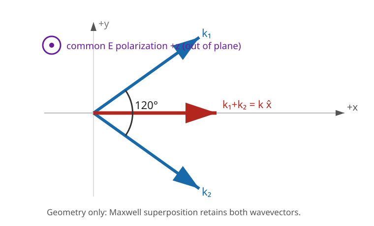

# Two Coherent Vacuum Plane Waves at 120 Degrees: Vector Superposition and the Atom 2.1 Interpretation Boundary

**Authors:** [Author names to be supplied by the project owner before submission]
**Affiliations:** [Affiliations to be supplied; none inferred]
**Document status:** Working theoretical manuscript; not peer reviewed
**Version:** 0.1.0 (2026-09-01)

## Abstract

We derive the classical vector superposition of two mutually coherent, equal-frequency, equal-amplitude vacuum plane-wave modes whose wavevectors meet at 120°, called the “Trinity angle” in Atom 2.1. The geometric crossing angle and a controllable relative phase are treated as independent parameters. For a common electric polarization normal to the wavevector plane, we obtain the exact wavevector sum and difference, transverse fringe spacing, electric and magnetic phasors, cycle-averaged energy density, Poynting vector, momentum density, and electromagnetic invariants. At local relative phase 120°, the normalized energy density is 7/8 and the normalized forward flux is 1/2; neither quantity has a phase extremum there. Linear vacuum Maxwell theory predicts interference and retains both input modes. It does not create a new independent photon, a localized object, or a neutrino. The Atom 2.1 phrase “neutrino seed” is therefore recorded only as a proposed interpretation requiring additional dynamics and discriminating tests. No experiment, CMB model, quantum-electrodynamic calculation, or empirical neutrino claim is presented.

## Keywords

electromagnetic interference; Maxwell equations; plane waves; 120-degree geometry; Poynting vector; phase control; Atom 2.1; hypothesis boundary

## 1. Introduction and Research Question

Atom 2.1 proposes that a 120° (“Trinity”) relation between electromagnetic excitations may participate in a neutrino-seed mechanism. Before any such mechanism is discussed, the underlying standard field addition must be calculated without adding nonlinear or particle assumptions.

**Research question:** For two identical coherent vacuum plane-wave modes whose propagation directions are separated by 120°, what field, energy, and momentum pattern follows from linear Maxwell theory as the relative phase is varied, and what—if anything—is special about a local phase of 120°?

The phrase “identical photon plane waves” is interpreted here as two classical modes with the same ω, k=ω/c, peak amplitude E₀, and polarization. A photon-number or particle-creation interpretation would require a quantum theory and is outside this paper.

## 2. Background

The source-free Maxwell equations are linear, so sums of solutions are solutions [1,2]. Coherent plane waves produce interference terms determined by their local phase difference and polarization overlap [3,4]. Energy density and Poynting flux are quadratic in the total fields; they can vary locally even though integration or averaging over complete fringes preserves the summed input energy and momentum accounting.

**Standard result:** Sections 3–5 use only classical vacuum Maxwell theory and standard coherence/interference mathematics.

**Project hypothesis:** Atom 2.1 may call a selected part of the interference pattern a “neutrino seed.” This terminology does not follow from Maxwell theory and is not used as a premise in the derivation.

**Open test:** A future seed hypothesis would need additional dynamics that produce localization, stability, neutrino properties, and an observable distinct from ordinary interference.

## 3. Methods and Reproducibility

### 3.1 Assumptions

1. Both fields are ideal monochromatic plane waves in a linear, homogeneous, isotropic vacuum.
2. They have the same angular frequency ω, wavenumber k=ω/c, and peak electric amplitude E₀.
3. They are mutually coherent.
4. Their wavevectors lie in the x-y plane and are symmetric about +x.
5. The crossing angle is α=2π/3, while the relative phase offset δ is independently controllable.
6. Both electric fields use the common transverse polarization **ẑ**.
7. Observables are local optical-cycle averages or averages over one complete transverse fringe.
8. No material, boundary, nonlinear, gravitational, CMB, or quantum interaction is included.

### 3.2 Wavevector geometry

Define unit propagation directions

**n₁**=(1/2,√3/2,0),  **n₂**=(1/2,−√3/2,0).  **(1)**

With **kᵢ**=k**nᵢ**,

**k₁**·**k₂**=−k²/2,  α=arccos(−1/2)=2π/3.  **(2)**

Their sum and difference are

**k₁**+**k₂**=k**x̂**,  **k₁**−**k₂**=√3k**ŷ**.  **(3)**

Equation (3) is vector geometry, not a mode-conversion rule. The total field retains both exponential phase factors.



**Figure 1.** Geometry of the two equal wavevectors. The common electric polarization is perpendicular to the drawing plane. The red arrow is the algebraic vector sum, not a newly created wave.

### 3.3 Fields and local phase

Using peak phasors with exp[i(**k**·**r**−ωt)],

**Ẽ**=E₀**ẑ**[e^{i**k₁**·**r**}+e^{i(**k₂**·**r**+δ)}],  **(4)**

**B̃**=(E₀/c)[(**n₁**×**ẑ**)e^{i**k₁**·**r**}+(**n₂**×**ẑ**)e^{i(**k₂**·**r**+δ)}].  **(5)**

The local relative phase is

Γ(**r**)=δ+(**k₂**−**k₁**)·**r**=δ−√3ky.  **(6)**

Changing δ translates the fringe pattern. The equal-phase-plane spacing is

d=2π/|**k₂**−**k₁**|=λ/√3.  **(7)**

### 3.4 Quadratic observables

The phasor magnitudes are

|**Ẽ**|²=2E₀²(1+cosΓ),  c²|**B̃**|²=E₀²(2−cosΓ).  **(8)**

For peak phasors, the cycle-averaged energy density is

⟨u⟩=(1/4)[ε₀|**Ẽ**|²+|**B̃**|²/μ₀]
=ε₀E₀²[1+(1/4)cosΓ].  **(9)**

Let I₀=ε₀cE₀²/2 be the cycle-averaged intensity of either input. Direct evaluation of Re(**Ẽ**×**B̃*** )/(2μ₀) gives

⟨**S**⟩=I₀**x̂**(1+cosΓ).  **(10)**

The vacuum momentum density is

⟨**g**⟩=⟨**S**⟩/c².  **(11)**

The cycle-averaged field invariants are

⟨E²−c²B²⟩=(3/2)E₀²cosΓ,  ⟨**E**·**B**⟩=0.  **(12)**

### 3.5 Reproducibility procedure

The standard-library audit calculates Equations (1)–(12), evaluates selected phases, and averages 720 evenly spaced samples over one fringe:

```text
python nodes/N015_trinity_phase_lock_seed_event/code/sim.py
python scripts/validate_nodes.py
python scripts/validate_papers.py
python -m pytest -q
```

No fitted parameter, random number, external data file, or hidden numerical dependency is used. Expected central values are encoded as deterministic assertions in `tests/test_n015_trinity_vector.py`.

## 4. Results

The 120° geometry gives |**k₁**+**k₂**|=k and a transverse fringe spacing λ/√3. The local phase controls interference, but the field remains the sum of two modes.

**Table 1. Exact phase-dependent values for the 120° crossing geometry.** Values use peak E₀, energy normalization ε₀E₀², and flux normalization I₀.

| Local phase Γ | |**Ẽ**|/E₀ | ⟨u⟩/(ε₀E₀²) | ⟨Sₓ⟩/I₀ | ⟨E²−c²B²⟩/E₀² |
|---:|---:|---:|---:|---:|
| 0 | 2 | 5/4 | 2 | 3/2 |
| 2π/3 | 1 | 7/8 | 1/2 | −3/4 |
| π | 0 | 3/4 | 0 | −3/2 |

At Γ=π the electric phasor cancels on that phase plane, but the magnetic field and energy density do not vanish. This is not a zero-field region.

Differentiating Equations (9) and (10) with respect to Γ gives

d[⟨u⟩/(ε₀E₀²)]/dΓ=−(1/4)sinΓ,
d(⟨Sₓ⟩/I₀)/dΓ=−sinΓ.  **(13)**

Therefore Γ=2π/3 is not a stationary phase. The standard extrema occur at Γ=0 and π.

Across one complete fringe, overline{cosΓ}=0, so

overline{⟨u⟩}=ε₀E₀²,  overline{⟨**S**⟩}=I₀**x̂**.  **(14)**

Equation (14) is the sum of the two single-wave energy densities and the vector sum of their individual Poynting fluxes. The interference pattern redistributes energy and momentum locally without creating net energy.

## 5. Discussion

### 5.1 Established interpretation

The standard interpretation is unambiguous: two coherent non-collinear Maxwell modes interfere. The crossing angle controls the wavevector geometry and fringe spacing; δ controls the translation of the local phase pattern. Their vector sum is useful momentum geometry, but it is not the wavevector of a replacement mode.

No local energy or flux maximum occurs at phase 120° for the declared common-polarization family. A theory that requires such a maximum is contradicted by this baseline and must change its input family or add explicit non-Maxwell dynamics.

### 5.2 Atom 2.1 “neutrino seed” proposal

Atom 2.1 may retain “neutrino seed” as a hypothesis label for a selected interference region. This paper supplies no evidential bridge from the interference pattern to a neutrino. In particular, Maxwell superposition provides no:

- new independent photon or normal mode,
- finite-energy localization,
- self-binding or persistent stability,
- rest mass or neutrino dispersion relation,
- weak-interaction behavior,
- neutrino flavor, helicity phenomenology, or oscillation behavior,
- source/sink mechanism beyond the original waves.

For the proposal to become scientific rather than terminological, a future model must specify new equations or boundary dynamics, a finite-energy initial-value problem, conserved quantities, a gauge- and Lorentz-consistent seed criterion, and a quantitative observation that differs from Equation (9)–(14).

## 6. Limitations and Scope

This paper deliberately stops at the initial algebraic/geometric vector addition.

- Infinite plane waves are non-localized idealizations with infinite total energy.
- Perfect mutual coherence and equal amplitudes/frequencies are assumed.
- Only the shared **ẑ** linear polarization is evaluated; other polarizations change cross terms.
- The phase δ is globally controllable only as an input offset; Γ varies with position for nonparallel waves.
- Cycle averages omit subcycle detector response.
- No finite aperture, wave packet, boundary, material, nonlinear response, gravity, or source dynamics is modeled.
- No CMB photon field, QED process, photon-number calculation, or neutrino phenomenology is included.
- No charge-only or magnetic-only propagating vacuum wave is proposed; each input satisfies the full Maxwell E/B relation.
- The deterministic checks establish algebraic consistency, not empirical discovery.

## 7. Conclusion

Two equal coherent vacuum plane waves crossing at 120° produce a standard phase-dependent Maxwell interference field. Their wavevectors add geometrically to k**x̂**, their transverse fringes have spacing λ/√3, and their local energy and forward momentum flux follow Equations (9)–(11). A local phase of 120° yields finite intermediate values, not an extremum. Linear Maxwell theory neither creates a new independent photon nor derives a neutrino. The calculation is therefore a necessary constraint on, rather than evidence for, the Atom 2.1 neutrino-seed hypothesis.

## Data and Code Availability

No empirical dataset was used or produced. The derivation is represented in node N015. Deterministic source code is in `nodes/N015_trinity_phase_lock_seed_event/code/sim.py`; verification assertions are in `tests/test_n015_trinity_vector.py`. The geometry figure is an SVG committed with the node. All inputs and expected values are stated in this manuscript.

## Author Contributions

[Placeholder: the actual authors must provide contribution roles before submission. No authorship or contribution allocation is inferred by the repository tooling.]

## Acknowledgments

[Placeholder: none declared in this repository version.]

## Declarations

- **Funding:** [Not declared; do not infer.]
- **Conflicts of interest:** [Not declared; authors must provide a statement.]
- **Ethics approval:** Not applicable to this theoretical calculation; no human participants, animals, or personal data are involved.
- **Consent to participate/publication:** Not applicable in the present repository version.
- **Empirical validation:** None claimed. Results are analytic and computational consistency checks within classical Maxwell assumptions.

## References

1. J. D. Jackson, *Classical Electrodynamics*, 3rd ed., Wiley (1999), ISBN 978-0-471-30932-1.
2. D. J. Griffiths, *Introduction to Electrodynamics*, 4th ed., Cambridge University Press (2017), ISBN 978-1-108-42041-9.
3. M. Born and E. Wolf, *Principles of Optics*, 7th ed., Cambridge University Press (1999), especially the treatment of interference, [doi:10.1017/CBO9781139644181](https://doi.org/10.1017/CBO9781139644181).
4. L. Mandel and E. Wolf, *Optical Coherence and Quantum Optics*, Cambridge University Press (1995), classical coherence framework, [doi:10.1017/CBO9781139644105](https://doi.org/10.1017/CBO9781139644105).

## Version and Provenance

Version 0.1.0, dated 2026-09-01. The manuscript was derived from standard baseline nodes N000 and N011 and the vector-first N015 formalization. It supersedes the earlier N015 placeholder as the readable account of this limited construction. The document is a working repository manuscript, has not been peer reviewed, and makes no priority, authorship, funding, or experimental-discovery claim.
